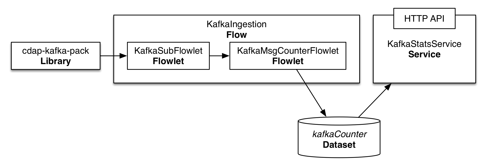

Subscribing to Kafka 
====================
Subscribing to a [Kafka](http://kafka.apache.org/) topic and processing the messages received in realtime is a common requirement in
big data applications. In this guide, you will learn how to accomplish it with the Cask Data Application Platform
([CDAP](http://cdap.io)).

What You Will Build
-------------------
You will build a CDAP application that consumes data from a Kafka cluster v0.8.x on a specific Topic and computes the 
average size of the messages received. You will:

- Build a realtime 
  [Flow](http://docs.cdap.io/cdap/current/en/developers-manual/building-blocks/flows-flowlets/index.html)
  that subscribes to a Kafka topic;
- Use the [cdap-kafka-pack library](https://github.com/caskdata/cdap-packs) to build a Flowlet to consume from Kafka;
- Use a 
  [Dataset](http://docs.cdap.io/cdap/current/en/developers-manual/building-blocks/datasets/index.html)
  to persist the results of the analysis; and
- Build a 
  [Service](http://docs.cdap.io/cdap/current/en/developers-manual/building-blocks/services.html)
  to retrieve the analysis results via an HTTP RESTful endpoint.

What You Will Need
------------------
- [JDK 6 or JDK 7](http://www.oracle.com/technetwork/java/javase/downloads/index.html)
- [Apache Maven 3.0+](http://maven.apache.org/)
- [CDAP SDK](http://docs.cdap.io/cdap/current/en/developers-manual/getting-started/standalone/index.html)

Let’s Build It!
---------------
Following sections will guide you through building an application from
scratch. If you are interested in deploying and running the application
right away, you can clone its source code from this GitHub repository.
In that case, feel free to skip the next two sections and jump right to
the [Build and Run Application](#build-and-run-application) section.

### Application Design

Realtime processing capability within CDAP is supported by Flows. The
application we are building in this guide uses a Flow for processing the
messages received on a Kafka topic. The count and total size of these messages 
are persisted in a Dataset and made available via an HTTP RESTful endpoint 
using a Service.



The Flow consists of two processing nodes called Flowlets:

-   A subscriber Flowlet that subscribes to a specific topic on a Kafka cluster 
    and emits the messages received to the next Flowlet.
-   A counter Flowlet that consumes the message emitted by the Kafka subscriber 
    Flowlet to update the basic statistics of Kafka messages: total message size and
    count.

### Application Implementation

The recommended way to build a CDAP application from scratch is to use a
Maven project. Use the following directory structure (you’ll find
contents of these files described below):

    ./pom.xml
    ./src/main/java/co/cask/cdap/guides/kafka/KafkaIngestionApp.java
    ./src/main/java/co/cask/cdap/guides/kafka/KafkaIngestionFlow.java
    ./src/main/java/co/cask/cdap/guides/kafka/KafkaMsgCounterFlowlet.java
    ./src/main/java/co/cask/cdap/guides/kafka/KafkaStatsHandler.java
    ./src/main/java/co/cask/cdap/guides/kafka/KafkaSubFlowlet.java

The application will use the `cdap-kafka-pack` library which includes an implementation of the
`Kafka08ConsumerFlowlet`, which is designed to work with a 0.8.x Kakfa Cluster. If you want to 
use the application with a 0.7.x Kakfa Cluster, please refer to the documentation of `cdap-kafka-pack`.

You'll need to add the correct `cdap-kafka-pack` library, based on your Kafka cluster version 
(`cdap-flow-compat-0.8` for this guide) as a dependency to your project's pom.xml:

```xml
...
<dependencies>
  ...
  <dependency>
    <groupId>co.cask.cdap.packs</groupId>
    <artifactId>cdap-kafka-flow-compat-0.8</artifactId>
    <version>0.1.0</version>
  </dependency>
</dependencies>
```

Create the `KafkaIngestionApp` class which declares that the application
has a Flow, a Service, and creates two Datasets:

```java
public class KafkaIngestionApp extends AbstractApplication {
  
  @Override
  public void configure() {
    setName(Constants.APP_NAME);
    createDataset(Constants.OFFSET_TABLE_NAME, KeyValueTable.class);
    createDataset(Constants.STATS_TABLE_NAME, KeyValueTable.class);
    addFlow(new KafkaIngestionFlow());
    addService(Constants.SERVICE_NAME, new KafkaStatsHandler());
  }
}
```

The `KafkaIngestionFlow` connects the `KafkaSubFlowlet` to the `KafkaMsgCounterFlowlet`.

```java
public class KafkaIngestionFlow implements Flow {

  @Override
  public FlowSpecification configure() {
    return FlowSpecification.Builder.with()
      .setName(Constants.FLOW_NAME)
      .setDescription("Subscribes to Kafka messages")
      .withFlowlets()
        .add(Constants.KAFKA_FLOWLET, new KafkaSubFlowlet())
        .add(Constants.COUNTER_FLOWLET, new KafkaMsgCounterFlowlet())
      .connect()
        .from(Constants.KAFKA_FLOWLET).to(Constants.COUNTER_FLOWLET)
      .build();
  }
}
```

The `KafkaSubFlowlet` subclasses from the `Kafka08ConsumerFlowlet` that is
available in the `cdap-kafka-pack` library:

```java
public class KafkaSubFlowlet extends Kafka08ConsumerFlowlet<byte[], String> {
  private static final Logger LOG = LoggerFactory.getLogger(KafkaSubFlowlet.class);

  @UseDataSet(Constants.OFFSET_TABLE_NAME)
  private KeyValueTable offsetStore;

  private OutputEmitter<String> emitter;

  @Override
  protected void configureKafka(KafkaConfigurer kafkaConfigurer) {
    Map<String, String> runtimeArgs = getContext().getRuntimeArguments();
    kafkaConfigurer.setZooKeeper(runtimeArgs.get("kafka.zookeeper"));
    kafkaConfigurer.addTopicPartition(runtimeArgs.get("kafka.topic"), 0);
  }

  @Override
  protected KeyValueTable getOffsetStore() {
    return offsetStore;
  }

  @Override
  protected void processMessage(String value) throws Exception {
    LOG.info("Message: {}", value);
    emitter.emit(value);
  }
}
```

Messages received by the `KafkaSubFlowlet` are consumed by the `KafkaMsgCounterFlowlet` 
that updates the total number of messages and their total size in the `kafkaCounter` Dataset:

```java
public class KafkaMsgCounterFlowlet extends AbstractFlowlet {
  private static final Logger LOG = LoggerFactory.getLogger(KafkaMsgCounterFlowlet.class);

  @UseDataSet(Constants.STATS_TABLE_NAME)
  private KeyValueTable counter;

  @ProcessInput
  public void process(String string) {
    LOG.info("Received: {}", string);
    counter.increment(Bytes.toBytes(Constants.COUNT_KEY), 1L);
    counter.increment(Bytes.toBytes(Constants.SIZE_KEY), string.length());
  }
}
```

In a real-world scenario, the Flowlet could perform more sophisticated
processing on the messages received from Kafka.

Finally, the `KafkaStatsHandler` uses the `kafkaCounter` Dataset to compute the
average message size and serve it over HTTP:

```java
@Path("/v1")
public class KafkaStatsHandler extends AbstractHttpServiceHandler {

  @UseDataSet(Constants.STATS_TABLE_NAME)
  private KeyValueTable statsTable;

  @Path("avgSize")
  @GET
  public void getStats(HttpServiceRequest request, HttpServiceResponder responder) throws Exception {
    long totalCount = statsTable.incrementAndGet(Bytes.toBytes(Constants.COUNT_KEY), 0L);
    long totalSize = statsTable.incrementAndGet(Bytes.toBytes(Constants.SIZE_KEY), 0L);
    responder.sendJson(totalCount > 0 ? totalSize / totalCount : 0);
  }
}
```

### Configuring the `KafkaSubFlowlet`

In order to utilize the `KafkaSubFlowlet`, a Kafka zookeeper connection string along with 
a Kafka topic must be provided as runtime arguments. You can provide these to the `KafkaSubFlowlet` as 
runtime arguments of the `KafkaIngestionFlow`. The keys of these runtime arguments are (see the Build and Run Application section for how to pass them to the program at start):

```console
kafka.zookeeper
kafka.topic
```

Build and Run Application
-------------------------
The KafkaIngestionApp application can be built and packaged using the Apache Maven command:

    mvn clean package

Note that the remaining commands assume that the `cdap-cli.sh` script is
available on your PATH. If this is not the case, please add it:

    export PATH=$PATH:<CDAP home>/bin

If you haven't already started a standalone CDAP installation, start it with the command:

    cdap.sh start

We can then deploy the application to a standalone CDAP installation and
start its components (note the runtime arguments as described above in [Configuring the KafkaSubFlowlet](#configuring-the-kafkasubflowlet)):

    cdap-cli.sh deploy app target/cdap-kafka-ingest-guide-1.0.0.jar
    curl http://localhost:10000/v2/apps/KafkaIngestionApp/flows/KafkaIngestionFlow/start -d '{"kafka.zookeeper":"127.0.0.1:1234", "kafka.topic":"MyTopic"}'
    curl -X POST http://localhost:10000/v2/apps/KafkaIngestionApp/services/KafkaStatsService/start
    
Once the Flow is started, Kafka messages are processed as they are published. You can query for
the average Kafka message size:

    curl http://localhost:10000/v2/apps/KafkaIngestionApp/services/KafkaStatsService/methods/v1/avgSize

Example output:

    14

Share and Discuss!
------------------
Have a question? Discuss at the [CDAP User Mailing List.](https://groups.google.com/forum/#!forum/cdap-user)

License
-------
Copyright © 2014 Cask Data, Inc.

Licensed under the Apache License, Version 2.0 (the "License"); you may
not use this file except in compliance with the License. You may obtain
a copy of the License at

http://www.apache.org/licenses/LICENSE-2.0

Unless required by applicable law or agreed to in writing, software
distributed under the License is distributed on an "AS IS" BASIS,
WITHOUT WARRANTIES OR CONDITIONS OF ANY KIND, either express or implied.
See the License for the specific language governing permissions and
limitations under the License.
