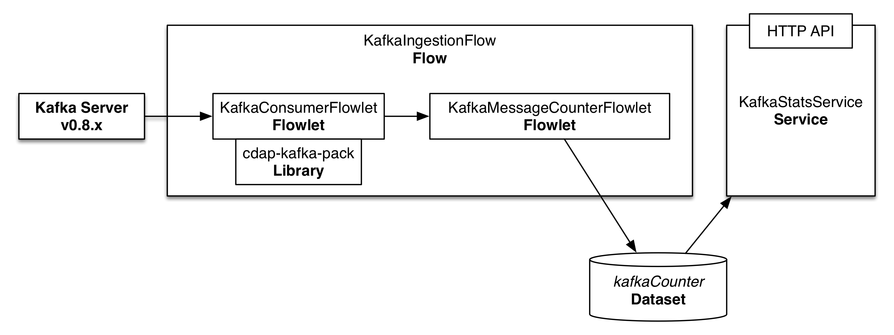

=========================
Consuming Data from Kafka
=========================

Consuming data from a `Kafka <http://kafka.apache.org/>`__ topic and processing the messages received in real time is 
a common part of many big data applications. In this guide, you will learn how to accomplish it with the 
Cask Data Application Platform (`CDAP <http://cdap.io>`__).

What You Will Build
===================

You will build a CDAP application that consumes data from a Kafka cluster v0.8.x on a specific topic and computes the 
average size of the messages received. You will:

- Build a real-time 
  `Flow <http://docs.cdap.io/cdap/current/en/developers-manual/building-blocks/flows-flowlets/index.html>`__
  that subscribes to a Kafka topic;
- Use the `cdap-kafka-pack library <https://github.com/caskdata/cdap-packs>`__ to build a Flowlet to consume from Kafka;
- Use a 
  `Dataset <http://docs.cdap.io/cdap/current/en/developers-manual/building-blocks/datasets/index.html>`__
  to persist the results of the analysis;
- Build a 
  `Service <http://docs.cdap.io/cdap/current/en/developers-manual/building-blocks/services.html>`__
  to retrieve the analysis results via an HTTP RESTful endpoint; and 
- Start a Kafka Server v0.8.x and publish messages to the topic which the CDAP Application is subscribed.

What You Will Need
==================

- `JDK 7 or 8 <http://www.oracle.com/technetwork/java/javase/downloads/index.html>`__
- `Apache Maven 3.1+ <http://maven.apache.org/>`__
- `CDAP SDK <http://docs.cdap.io/cdap/current/en/developers-manual/getting-started/standalone/index.html>`__
- `Kafka v0.8.x <http://kafka.apache.org>`__

Let’s Build It!
===============

Following sections will guide you through building an application from
scratch. If you are interested in deploying and running the application
right away, you can clone its source code from this GitHub repository.
In that case, feel free to skip the next two sections and jump right to
the `Build and Run Application <#build-and-run-application>`__ section.

Application Implementation
--------------------------

Real-time processing capability within CDAP is supported by Flows. The
application we are building in this guide uses a Flow for processing the
messages received on a Kafka topic. The count and total size of these messages 
are persisted in a Dataset and made available via an HTTP RESTful endpoint 
using a Service.

The Flow consists of two processing nodes called Flowlets:

-   A subscriber Flowlet that subscribes to a specific topic on a Kafka cluster 
    and emits the messages received to the next Flowlet.
-   A counter Flowlet that consumes the message emitted by the Kafka subscriber 
    Flowlet to update the basic statistics of Kafka messages: total message size and
    count.

Application Implementation
--------------------------

The recommended way to build a CDAP application from scratch is to use a
Maven project. Use the following directory structure (you’ll find
contents of these files described below)::

  ./pom.xml
  ./src/main/java/co/cask/cdap/guides/kafka/KafkaConsumerFlowlet.java
  ./src/main/java/co/cask/cdap/guides/kafka/KafkaIngestionApp.java
  ./src/main/java/co/cask/cdap/guides/kafka/KafkaIngestionFlow.java
  ./src/main/java/co/cask/cdap/guides/kafka/KafkaMessageCounterFlowlet.java
  ./src/main/java/co/cask/cdap/guides/kafka/KafkaStatsHandler.java

The application will use the ``cdap-kafka-pack`` library which includes an implementation of the
``Kafka08ConsumerFlowlet``, which is designed to work with a 0.8.x Kakfa Cluster. If you want to 
use the application with a 0.7.x Kakfa Cluster, please refer to the documentation of `c`dap-kafka-pack``.

You'll need to add the correct ``cdap-kafka-pack`` library, based on your Kafka cluster version 
(``cdap-flow-compat-0.8`` for this guide) as a dependency to your project's pom.xml:

.. code:: xml

  ...
  <dependencies>
    ...
    <dependency>
      <groupId>co.cask.cdap</groupId>
      <artifactId>cdap-kafka-flow-compat-0.8</artifactId>
      <version>0.1.0</version>
    </dependency>
  </dependencies>

Create the ``KafkaIngestionApp`` class which declares that the application has a Flow, a Service, 
and creates two Datasets:

.. code:: java

  public class KafkaIngestionApp extends AbstractApplication {
  
    @Override
    public void configure() {
      setName(Constants.APP_NAME);
      createDataset(Constants.OFFSET_TABLE_NAME, KeyValueTable.class);
      createDataset(Constants.STATS_TABLE_NAME, KeyValueTable.class);
      addFlow(new KafkaIngestionFlow());
      addService(Constants.SERVICE_NAME, new KafkaStatsHandler());
    }
  }

The ``KafkaIngestionFlow`` connects the ``KafkaConsumerFlowlet`` to the ``KafkaMessageCounterFlowlet``:

.. code:: java

  public class KafkaIngestionFlow implements Flow {

    @Override
    public FlowSpecification configure() {
      return FlowSpecification.Builder.with()
        .setName(Constants.FLOW_NAME)
        .setDescription("Subscribes to Kafka messages")
        .withFlowlets()
          .add(Constants.KAFKA_FLOWLET, new KafkaConsumerFlowlet())
          .add(Constants.COUNTER_FLOWLET, new KafkaMessageCounterFlowlet())
        .connect()
          .from(Constants.KAFKA_FLOWLET).to(Constants.COUNTER_FLOWLET)
        .build();
    }
  }

The ``KafkaConsumerFlowlet`` subclasses from the ``Kafka08ConsumerFlowlet`` available in the ``cdap-kafka-pack`` library:

.. code:: java

  public class KafkaConsumerFlowlet extends Kafka08ConsumerFlowlet<byte[], String> {
    private static final Logger LOG = LoggerFactory.getLogger(KafkaConsumerFlowlet.class);

    @UseDataSet(Constants.OFFSET_TABLE_NAME)
    private KeyValueTable offsetStore;

    private OutputEmitter<String> emitter;

    @Override
    protected void configureKafka(KafkaConfigurer kafkaConfigurer) {
      Map<String, String> runtimeArgs = getContext().getRuntimeArguments();
      kafkaConfigurer.setZooKeeper(runtimeArgs.get("kafka.zookeeper"));
      kafkaConfigurer.addTopicPartition(runtimeArgs.get("kafka.topic"), 0);
    }

    @Override
    protected KeyValueTable getOffsetStore() {
      return offsetStore;
    }

    @Override
    protected void processMessage(String value) throws Exception {
      LOG.info("Message: {}", value);
      emitter.emit(value);
    }
  }

Messages received by the ``KafkaConsumerFlowlet`` are consumed by the ``KafkaMessageCounterFlowlet`` 
that updates the total number of messages and their total size in the ``kafkaCounter`` Dataset:

.. code:: java

  public class KafkaMessageCounterFlowlet extends AbstractFlowlet {
    private static final Logger LOG = LoggerFactory.getLogger(KafkaMessageCounterFlowlet.class);

    @UseDataSet(Constants.STATS_TABLE_NAME)
    private KeyValueTable counter;

    @ProcessInput
    public void process(String string) {
      LOG.info("Received: {}", string);
      counter.increment(Bytes.toBytes(Constants.COUNT_KEY), 1L);
      counter.increment(Bytes.toBytes(Constants.SIZE_KEY), string.length());
    }
  }

In a real-world scenario, the Flowlet could perform more sophisticated
processing on the messages received from Kafka.

Finally, the ``KafkaStatsHandler`` uses the ``kafkaCounter`` Dataset to compute the
average message size and serve it over HTTP:

.. code:: java

  @Path("/v1")
  public class KafkaStatsHandler extends AbstractHttpServiceHandler {

    @UseDataSet(Constants.STATS_TABLE_NAME)
    private KeyValueTable statsTable;

    @Path("avgSize")
    @GET
    public void getStats(HttpServiceRequest request, HttpServiceResponder responder) throws Exception {
      long totalCount = statsTable.incrementAndGet(Bytes.toBytes(Constants.COUNT_KEY), 0L);
      long totalSize = statsTable.incrementAndGet(Bytes.toBytes(Constants.SIZE_KEY), 0L);
      responder.sendJson(totalCount > 0 ? totalSize / totalCount : 0);
    }
  }

Configuring the *KafkaConsumerFlowlet*
--------------------------------------

In order to utilize the ``KafkaConsumerFlowlet``, a Kafka ZooKeeper connection string along with 
a Kafka topic must be provided as runtime arguments. You can provide these to the ``KafkaConsumerFlowlet`` as 
runtime arguments of the ``KafkaIngestionFlow``. (See the `Build and Run Application <#build-and-run-application>`__ 
section for information on how to pass the arguments to the program at the start.)
The keys of these runtime arguments are:

.. code:: console

  kafka.zookeeper
  kafka.topic

Build and Run Application
=========================

The ``KafkaIngestionApp`` application can be built and packaged using the Apache Maven command::

  $ mvn clean package

Note that the remaining commands assume that the ``cdap-cli.sh`` script is
available on your PATH. If this is not the case, please add it::

  $ export PATH=$PATH:<CDAP home>/bin

If you haven't already started a standalone CDAP installation, start it with the command::

  $ cdap.sh start

We can then deploy the application to a standalone CDAP installation::

  $ cdap-cli.sh deploy app target/cdap-kafka-ingest-guide-<version>.jar
  
We can then start its components (note the runtime arguments, as described above in `Configuring the KafkaConsumerFlowlet <#configuring-the-kafkaconsumerflowlet>`__)::

  $ curl -w'\n' http://localhost:10000/v3/namespaces/default/apps/KafkaIngestionApp/flows/KafkaIngestionFlow/start -d '{"kafka.zookeeper":"localhost:2181", "kafka.topic":"MyTopic"}'
  $ curl -X POST http://localhost:10000/v3/namespaces/default/apps/KafkaIngestionApp/services/KafkaStatsService/start

You can also use the CDAP CLI to start the Flow and Service::

  $ cdap-cli.sh start flow KafkaIngestionApp.KafkaIngestionFlow \'"kafka.zookeeper"="localhost:2181", "kafka.topic"="MyTopic"\'  
  $ cdap-cli.sh start service KafkaIngestionApp.KafkaStatsService
    
Once the Flow is started, Kafka messages are processed as they are published. Now, let's send data to the Kafka topic.

Publish Messages to a Kakfa topic
---------------------------------
If you don't have Kafka v0.8.x, you can download the binary at `Kafka 0.8.x Download <http://kafka.apache.org/downloads.html>`__.
Be sure you download v0.8.x (we recommend `Kafka v0.8.0 <https://archive.apache.org/dist/kafka/0.8.0/kafka_2.8.0-0.8.0.tar.gz>`__), 
as this guide is designed to work specifically with that version. 

Follow the instructions on `Kafka v0.8.x Quickstart <https://kafka.apache.org/08/quickstart.html>`__ to publish messages to ``MyTopic``.
The instructions are repeated below for your convenience and assume you have downloaded the binary distribution::

  $ tar xzf kafka-<VERSION>.tgz
  $ cd kafka-<VERSION>
  
  # Start ZooKeeper Server
  $ bin/zookeeper-server-start.sh config/zookeeper.properties
  
  # Start Kafka Server: Ignore any java.net.BindException exceptions thrown (since there could be port conflict with standalone CDAP's ZooKeeper Server)
  $ bin/kafka-server-start.sh config/server.properties
  
  # Create a new Kafka topic: MyTopic (use the correct arguments based on the script available in the bin directory)
  $ bin/kafka-create-topic.sh --zookeeper localhost:2181 --replica 1 --partition 1 --topic MyTopic

  # (OR)
  $ bin/kafka-topics.sh --create --zookeeper localhost:2181 --topic MyTopic --partitions 1 --replication-factor 1
  
  # Send messages on the topic: MyTopic
  $ bin/kafka-console-producer.sh --broker-list localhost:9092 --topic MyTopic

Once the ``kafka-console-producer.sh`` script is invoked, you can type messages on the console and every line is published as a message
to ``MyTopic``. Go ahead and publish a few messages, such as::

  CDAP and Kafka, working together!

Query Results
-------------
You can query for the average size of the Kafka messages::

  $ curl -w'\n' http://localhost:10000/v3/namespaces/default/apps/KafkaIngestionApp/services/KafkaStatsService/methods/v1/avgSize

Example output::

  6

Share and Discuss!
==================
Have a question? Discuss at the `CDAP User Mailing List. <https://groups.google.com/forum/#!forum/cdap-user>`__

License
=======
Copyright © 2014-2015 Cask Data, Inc.

Licensed under the Apache License, Version 2.0 (the "License"); you may
not use this file except in compliance with the License. You may obtain
a copy of the License at

http://www.apache.org/licenses/LICENSE-2.0

Unless required by applicable law or agreed to in writing, software
distributed under the License is distributed on an "AS IS" BASIS,
WITHOUT WARRANTIES OR CONDITIONS OF ANY KIND, either express or implied.
See the License for the specific language governing permissions and
limitations under the License.
